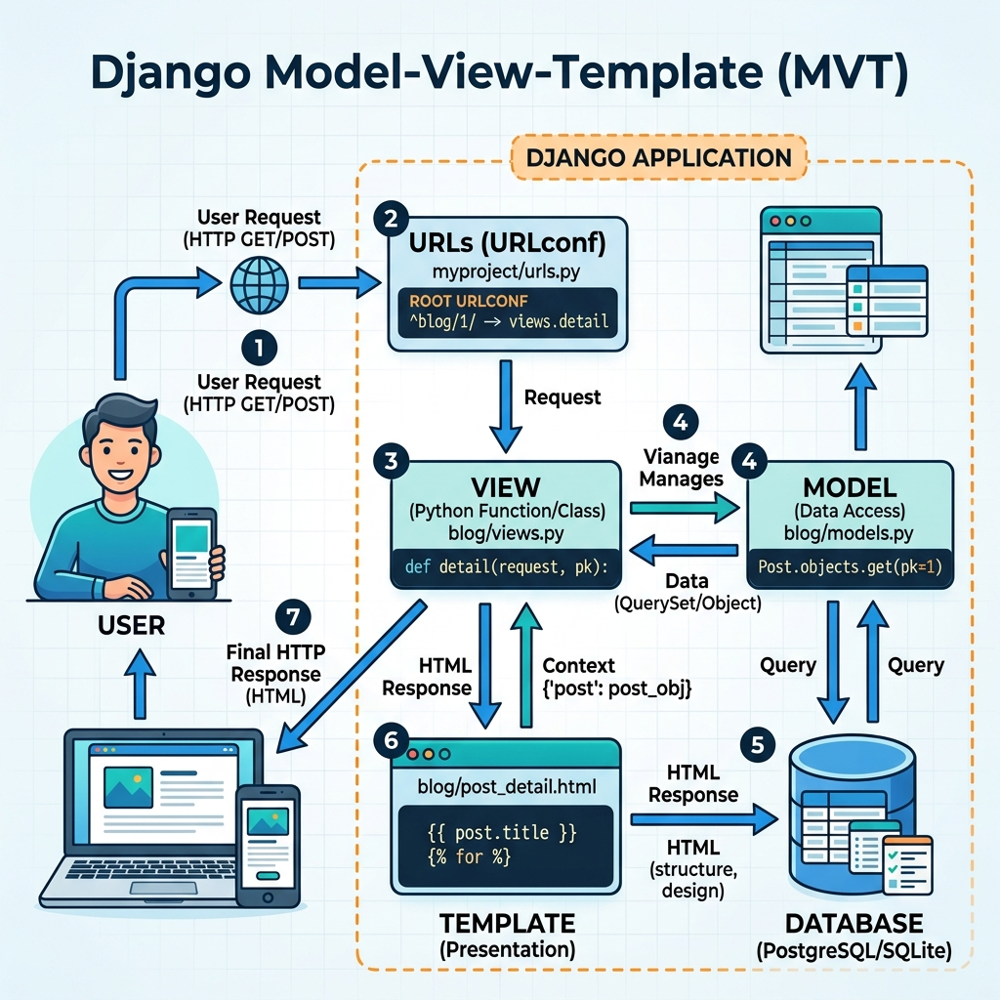

# Session 1 & 2: Introduction to Django & MVT Architecture

Welcome to the exciting world of web development! In this session, we will introduce you to Django, a powerful framework for building web applications using Python. We will cover what it is, how to set up your environment, and the architecture that powers it.

---

## Part 1: Introduction to Django

### 1. What is Django?
Django is a high-level Python web framework that encourages rapid development and clean, pragmatic design. Built by experienced developers, it takes care of much of the hassle of web development, so you can focus on writing your app without needing to reinvent the wheel. It’s free and open source.

Think of a framework like a pre-built house structure. Instead of making bricks and mixing cement yourself, the framework gives you the walls, roof, and foundation. You just need to paint the walls, choose the furniture, and arrange the rooms (i.e., build your specific application logic).

### 2. Features of Django
*   **"Batteries Included":** Django comes with many common web development tools out of the box, such as user authentication, a built-in admin panel, and database management tools.
*   **Fast:** It was designed to help developers take applications from concept to completion as quickly as possible.
*   **Secure:** Django helps developers avoid many common security mistakes, such as SQL injection, cross-site scripting (XSS), and clickjacking.
*   **Scalable:** Some of the busiest sites on the internet (like Instagram and Pinterest) use Django to quickly and flexibly scale to handle heavy traffic demands.

### 3. Application of Django Framework
Because of its versatility, Django is used to build almost any type of website:
*   Content Management Systems (CMS)
*   Social Networks
*   Scientific Computing Platforms
*   E-commerce Sites

### 4. Setting up the Django Environment
Before we write any code, we need to prepare our workspace. We will be using the command line (Terminal on Mac/Linux or Command Prompt/PowerShell on Windows).

**Step 1: The Virtual Environment**
*Why do we need this?* Imagine you are working on two projects: Project A needs Django version 3, and Project B needs Django version 5. If you install Django globally on your computer, they will conflict. A virtual environment is an isolated "box" for your project. What happens in the box stays in the box.

```bash
# This command tells python to use its built-in 'venv' module to create a new folder called 'myenv' which will hold our isolated environment.
python -m venv myenv
```

**Step 2: Activating the Environment**
*Why do we need this?* Creating the box isn't enough; we have to step inside it.
*   On Windows: `myenv\Scripts\activate`
*   On Mac/Linux: `source myenv/bin/activate`

**Step 3: Installing Django**
*Why do we need this?* Now that we are inside our isolated box, we use `pip` (Python's package installer) to download Django from the internet and install it inside this specific box.
```bash
pip install django
```

**Step 4: Creating a Django Project**
*Why do we need this?* We need a starting point! Django provides a command that automatically generates a basic folder structure so we don't have to create every file manually.
```bash
# 'django-admin' is a tool installed alongside Django. 
# 'startproject' tells it to build the scaffolding. 
# 'mysite' is the name we chose for our project.
django-admin startproject mysite
```

### 5. Understanding the Folder Structure
When you run the `startproject` command, Django creates a folder structure. Let's explore what each file does:

```text
mysite/                  <-- The outer root directory. Just a container for your project.
    manage.py            <-- A command-line utility that lets you interact with this project (e.g., running the server).
    mysite/              <-- The actual Python package for your project.
        __init__.py      <-- An empty file that tells Python this folder should be treated as a package.
        settings.py      <-- Configuration settings (database, time zone, installed apps). The central brain of the project.
        urls.py          <-- The Table of Contents for your site. It routes a web URL (like /about) to the correct code.
        asgi.py          <-- Entry-point for ASGI-compatible web servers to serve your project (for asynchronous operations).
        wsgi.py          <-- Entry-point for WSGI-compatible web servers to serve your project (for traditional deployment).
```

---

## Part 2: Model View Template (MVT) Architecture

### 1. What is MVT?
Any modern web application needs a way to organize its code so it doesn't become a tangled mess. Django uses a pattern called **MVT (Model-View-Template)**.
*   **Model:** The Data Layer. It defines your database structure. If you need a database table to store "Students", you write a Model.
*   **View:** The Logic Layer. The brain that connects the user, the database, and the template. It receives a user's request, fetches necessary data from the Model, and passes it to the Template.
*   **Template:** The Presentation Layer. This is what the user actually sees on their screen (HTML, CSS, JavaScript). 

### 2. Structure of MVT


Imagine a restaurant:
1.  **User Request:** A customer orders a burger from the menu.
2.  **View (The Waiter):** Takes the order and goes to the kitchen.
3.  **Model (The Chef & Pantry):** Gathers the ingredients (data) from the pantry (database) and cooks the burger.
4.  **Template (The Plate):** The presentation of the burger on a nice plate.
5.  **User Response:** The waiter delivers the plated burger back to the customer.

### 3. How Django follows MVT
1. A user types a URL in their browser (`www.yoursite.com/students`).
2. Django looks at `urls.py` to find which **View** is responsible for the `/students` path.
3. The **View** asks the **Model** for a list of all students from the database.
4. The **Model** fetches the data and hands it to the **View**.
5. The **View** takes an HTML **Template** and injects the student data into it.
6. The final HTML page is sent back to the user's browser.

### 4. Difference between MVT and MVC
You might hear professional developers talk about **MVC (Model-View-Controller)**. Django's MVT is very similar, but the names are shifted:

*   **Model (MVC)** = **Model (MVT)**: Both handle data.
*   **View (MVC)** = **Template (MVT)**: What MVC calls a View (presentation), Django calls a Template.
*   **Controller (MVC)** = **View (MVT)**: What MVC calls a Controller (logic/brain), Django calls a View.

*Where is the Controller in Django?* In Django, the framework itself acts as the Controller! It handles the routing of requests to the correct View automatically.


## Recommended Video Tutorials
Students can search for the following excellent YouTube tutorials on their own to supplement this session:

1. Corey Schafer - Django Tutorial Part 1: Getting Started
2. Programming with Mosh - Django Tutorial for Beginners
3. Tech With Tim - Django Framework Tutorial - Part 1
4. Dennis Ivy - Django Crash Course

