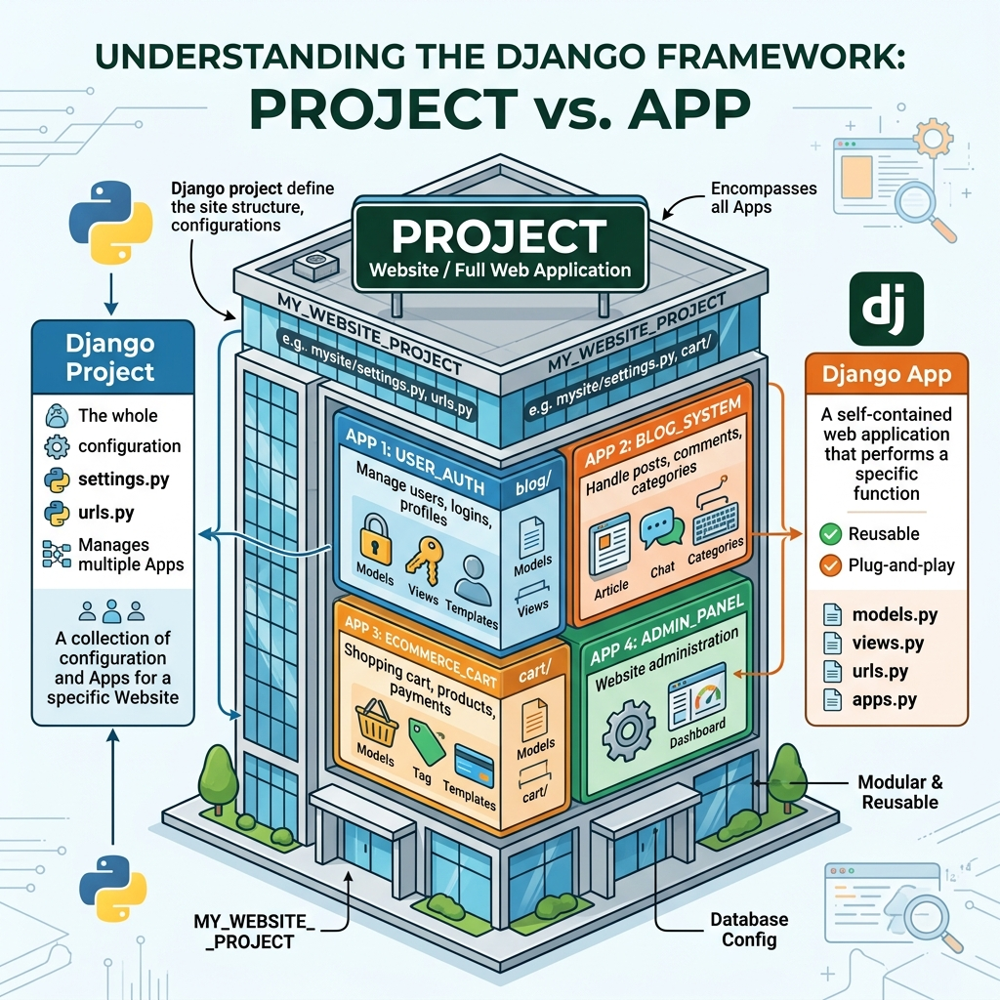

# Session 2: Creating a Website

In our last session, we learned what Django is and how to start a server. But a project is just an empty container. Real functionality in Django comes from **Apps**. Today, we will learn how to create apps, activate them, and wire up the MVT (Model-View-Template) components to display our first real web page.

---

## 1. Starting a Project (Recap)
A project is the entire web application. Think of the project as your school building.
```bash
django-admin startproject myschool
```
*Why? This sets up the central configuration, database connections, and overarching settings for everything that will be built inside.*

## 2. Creating an App Inside a Project


While a project is the whole school, an **App** is a specific department (like the Library, the Cafeteria, or the Science department). A Django project can contain many apps, and apps can be reused in different projects.

To create an app, you must be inside your project folder (where `manage.py` lives).
```bash
cd myschool
python manage.py startapp students
```
*Why? `manage.py startapp` generates a new folder named `students` with pre-configured files (like `models.py` and `views.py`) dedicated specifically to handling student-related data and logic.*

## 3. Activating the App
Just creating the app folder doesn't mean Django knows about it. You have to explicitly tell the central project settings that the new app exists.

Open `myschool/settings.py` and find the `INSTALLED_APPS` list. Add your new app to the list:
```python
INSTALLED_APPS = [
    'django.contrib.admin',
    'django.contrib.auth',
    'django.contrib.contenttypes',
    'django.contrib.sessions',
    'django.contrib.messages',
    'django.contrib.staticfiles',
    # Add your new app here:
    'students', 
]
```
*Why? Django only looks for database models, templates, and administrative configurations in apps that are formally registered in this list. If you forget this step, Django will ignore your new app.*

## 4. Wiring the MVT: Templates, Views, URLs, and Models

Now we will follow the MVT architecture to display a simple list of students. We will do this step-by-step.

### Step 4A: Create the Model (The Database)
Open `students/models.py`. Here we define what a "Student" is.
```python
from django.db import models

class Student(models.Model):
    first_name = models.CharField(max_length=50)
    last_name = models.CharField(max_length=50)

    def __str__(self):
        return self.first_name + " " + self.last_name
```
*Why? We are telling Django to create a database table with two text columns (first_name, last_name). `models.CharField` tells the database to expect text. The `__str__` method just ensures the student is displayed by their name rather than as "Object 1" in the system.*

*(Note: To actually create this table in the database, we run migrations: `python manage.py makemigrations` and `python manage.py migrate`.)*

### Step 4B: Create the View (The Logic)
Open `students/views.py`. This is where we write a function that fetches data and passes it to the template.
```python
from django.shortcuts import render
from .models import Student

def student_list(request):
    # Fetch all students from the database
    all_students = Student.objects.all() 
    
    # Pass the data to the template
    return render(request, 'students/student_list.html', {'students': all_students})
```
*Why? The `request` object contains data from the user's browser. `Student.objects.all()` asks the database for every student. `render` combines our HTML file with the database data and sends it back to the user.*

### Step 4C: Create the Template (The HTML)
Inside the `students` folder, create a new folder called `templates`, then inside that, create another folder called `students`. Finally, create `student_list.html`.
*(Path: `students/templates/students/student_list.html`)*

```html
<!DOCTYPE html>
<html>
<head>
    <title>Student List</title>
</head>
<body>
    <h1>Our Students</h1>
    <ul>
        
            <li>{{ student.first_name }} {{ student.last_name }}</li>
        
    </ul>
</body>
</html>
```
*Why? The `` and `{{ }}` tags are Django's template language. They allow us to write a loop in HTML. `{{ student.first_name }}` injects the database data directly into the webpage.*

### Step 4D: Connect the URLs (The Routing)
How does a user actually trigger the view? We need to connect a URL to the View.

First, create a new file `urls.py` inside the `students` app folder:
```python
from django.urls import path
from . import views

urlpatterns = [
    path('list/', views.student_list, name='student_list'),
]
```
*Why? This says: "If a user goes to the `/list/` URL, run the `student_list` view function."*

Next, we must tell the MAIN project about the app's URLs. Open `myschool/urls.py` and modify it:
```python
from django.contrib import admin
from django.urls import path, include

urlpatterns = [
    path('admin/', admin.site.urls),
    # Add this line:
    path('students/', include('students.urls')), 
]
```
*Why? The main `urls.py` delegates traffic. If the URL starts with `students/`, it hands control over to the `students` app's `urls.py`. The final URL will be `127.0.0.1:8000/students/list/`.*


## Recommended Video Tutorials
Students can search for the following excellent YouTube tutorials on their own to supplement this session:

1. Corey Schafer - Django Tutorial Part 2: Applications & Routes
2. Traversy Media - Django Crash Course
3. FreeCodeCamp - Django Web Development Course
4. Dennis Ivy - Django App Routing

