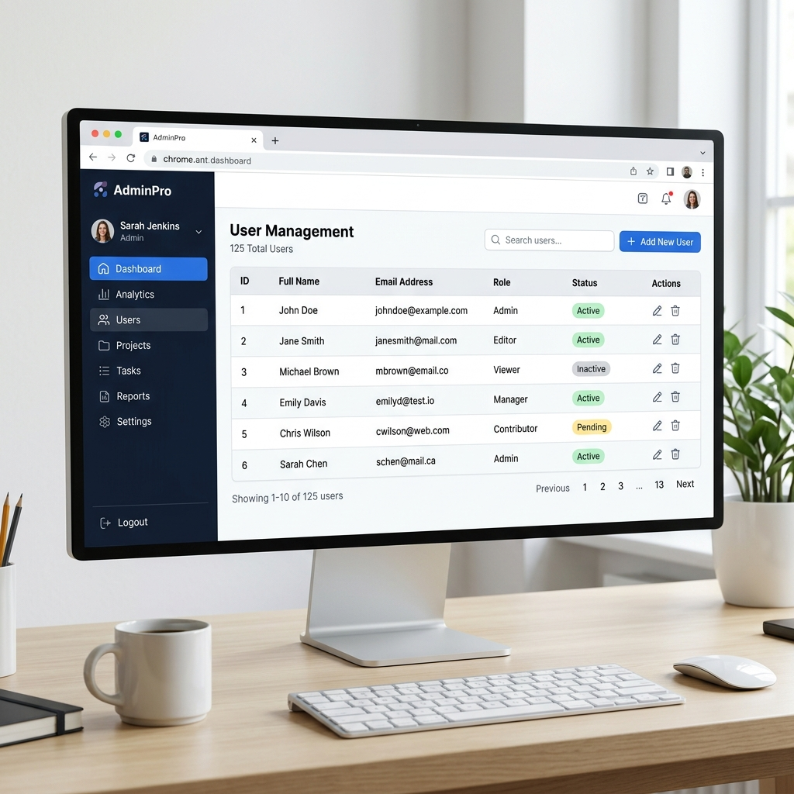

# Session 4: Admin Panel and Admin Interface

Building web applications usually requires two interfaces: the public-facing website for regular users, and a secure backend dashboard for administrators to manage data (users, posts, products, etc.). Django provides an incredibly powerful, ready-to-use Admin Panel out of the box.

---

## 1. What is the Django Admin Interface?

The Django Admin Interface is a built-in web application that automatically reads your `models.py` files and provides a quick, database-centric interface where trusted users can manage content on your site.

**Key Benefits:**
*   **Zero Configuration Needed (Almost):** It works immediately after setting up a project.
*   **Time-saving:** You don't have to spend weeks building a dashboard just to add or delete database records.
*   **Secure:** It includes built-in login authentication and permissions.

## 2. Exploring the Admin Interface


If you look closely at your main `urls.py` file created by Django in Session 1, you will see this line:
```python
path('admin/', admin.site.urls),
```
*Why? This is Django's default routing for the admin interface. It means if you run your server and go to `http://127.0.0.1:8000/admin/`, you will be greeted by a login screen.*

But right now, if you try to log in, you can't! We haven't created any user accounts yet. Moreover, we need to create the actual database tables that Django's authentication system relies on.

## 3. Creating a Superuser

Before creating a user, we must prepare the database. When we first install Django, it has many built-in apps (like `auth` for authentication) waiting to be installed in the database.

**Step 1: Run Migrations**
```bash
python manage.py migrate
```
*Why? `migrate` looks at all your installed apps and creates the necessary database tables (like the `Users` table) in your SQLite database. Without tables, you can't save a user.*

**Step 2: Create the Superuser**
A superuser is an account with all permissions—the keys to the kingdom.
```bash
python manage.py createsuperuser
```
*Why? This triggers an interactive prompt in your terminal. You will be asked for a username, email address, and password. (Note: When you type your password, nothing will show on the screen for security reasons. Just keep typing and press Enter).*

**Step 3: Log In**
Now, run `python manage.py runserver`, go to `/admin/`, and log in with your new credentials. You will see sections for "Groups" and "Users". These are managed by Django's built-in authentication system.

## 4. Customizing the Admin Panel

The Admin panel is great, but right now, it only shows "Users" and "Groups". How do we get it to show the `Student` model we created in Session 2? We have to register it!

### Step 1: Registering a Model
Open `students/admin.py`. This file exists specifically to tell the Admin interface about your app's models.

```python
from django.contrib import admin
from .models import Student

# Register your models here.
admin.site.register(Student)
```
*Why? `admin.site.register()` hooks your database model into the Admin dashboard. Refresh your admin page, and "Students" will appear! You can now click "Add" to create a new student right from your browser.*

### Step 2: Advanced Customization
Just listing "Student object" isn't very helpful. We can customize exactly how the models are displayed in the admin panel by creating a `ModelAdmin` class.

Update `students/admin.py`:
```python
from django.contrib import admin
from .models import Student

class StudentAdmin(admin.ModelAdmin):
    # Determine which columns to show in the list view
    list_display = ('first_name', 'last_name')
    
    # Add a search bar to search by first or last name
    search_fields = ('first_name', 'last_name')
    
    # Add filters on the right sidebar
    list_filter = ('last_name',)

# Notice we pass the customization class as the second argument
admin.site.register(Student, StudentAdmin)
```
*Why? By inheriting from `admin.ModelAdmin`, we unlock powerful customization features. `list_display` turns a simple list into a multi-column data table. `search_fields` adds a search bar automatically. This makes managing hundreds of records incredibly easy for the site owner.*
