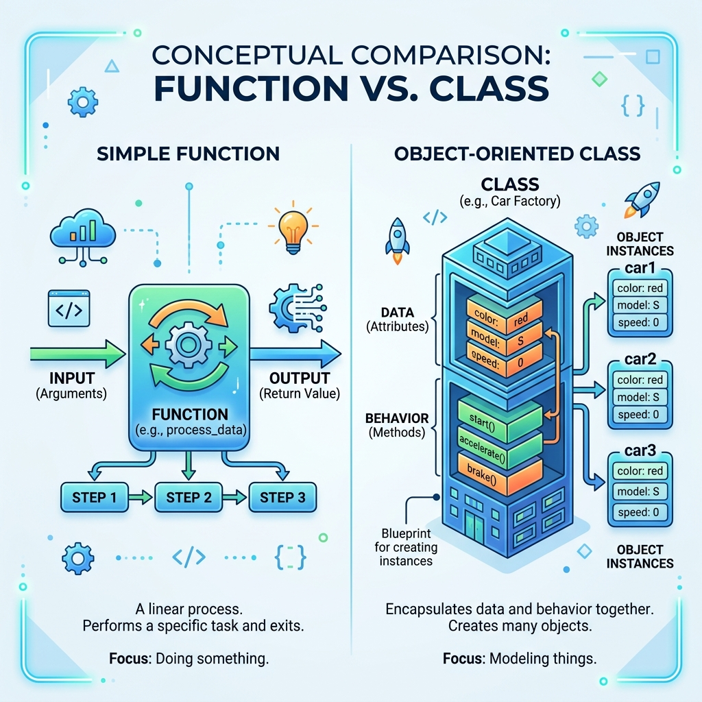

# Session 5: Django View Creation

Welcome to Week 2! We've already seen simple Views in action, but today we will dive deep into the "V" of our MVT architecture. Views are the brain of your application. They receive the user's web request, decide what to do with it, and return a web response.

---

## 1. Defining and Creating Views
A view is simply a Python function or a Python class that takes a web request and returns a web response. This response can be HTML content, a redirect, a 404 error, an XML document, or an image. 

*Why do we need views?* Without a view, Django doesn't know *what* logic to execute when a user visits a URL. The view is where you put your "business logic" (e.g., "If the user is logged in, show their profile; if not, show the login page.").

## 2. Types of Views in Django
Django provides two main ways to write views:
1.  **Function-Based Views (FBVs):** Views written as standard Python functions.
2.  **Class-Based Views (CBVs):** Views written as Python classes that inherit from Django's built-in view classes.

## 3. Function-Based Views (FBVs) vs. Class-Based Views (CBVs)


| Feature | Function-Based Views | Class-Based Views |
| :--- | :--- | :--- |
| **Structure** | Standard Python `def` | Python `class` |
| **Readability** | Very easy to read top-to-bottom | Can be hard to read due to hidden inherited code |
| **Code Reuse** | Low (requires writing helper functions) | High (can use object-oriented inheritance and mixins) |
| **Boilerplate** | High (you write the same `if request.method == 'POST':` repeatedly) | Low (Django handles standard HTTP methods behind the scenes) |

## 4. Pros and Cons

### Function-Based Views
*   **Pros:** Very straightforward. Excellent for beginners. You can see exactly what the code is doing line-by-line. Great for highly custom logic that doesn't fit a standard mold.
*   **Cons:** You end up repeating a lot of code for common tasks (like fetching a list of objects from the database).

### Class-Based Views
*   **Pros:** Django provides "Generic CBVs" for common tasks (like displaying a list, creating a form, showing details). You can build complex pages with just 3 lines of code! Excellent for code reuse.
*   **Cons:** Steep learning curve. Because Django hides the complex logic inside the parent class, it can feel like "magic." If it breaks, it is harder to debug for beginners.

## 5. Creating a Function-Based View
Let's look at how to create an FBV. You open your app's `views.py` file:

```python
from django.shortcuts import render
from .models import Book

def book_list_fbv(request):
    # 1. Logic: Fetch all books
    books = Book.objects.all()
    
    # 2. Response: Render the template with the data
    return render(request, 'catalog/book_list.html', {'books': books})
```
*Why? We define a function taking `request` as an argument. It queries the database, puts the results in a dictionary `{'books': books}`, and uses `render` to combine the data with an HTML file.*

## 6. Describing the Operation of a Class-Based View
Now let's do the exact same thing using a generic Class-Based View. 

```python
from django.views.generic import ListView
from .models import Book

class BookListCBV(ListView):
    model = Book
    template_name = 'catalog/book_list.html'
    context_object_name = 'books'
```
*Why? Instead of writing the fetch logic and the render function, we inherit from `ListView`. `ListView` already knows how to fetch all objects and render a template. We simply give it variables (`model`, `template_name`). Django does the rest behind the scenes!*

## 7. Configuring URLs for Different Kinds of Views
Because FBVs and CBVs are structurally different (one is a function, one is a class), we must configure them differently in `urls.py`.

```python
from django.urls import path
from . import views

urlpatterns = [
    # Routing a Function-Based View
    path('fbv-books/', views.book_list_fbv, name='fbv_list'),

    # Routing a Class-Based View
    path('cbv-books/', views.BookListCBV.as_view(), name='cbv_list'),
]
```
*Why? The URL dispatcher requires a callable function. Since `book_list_fbv` is already a function, we pass it directly. But `BookListCBV` is a class. We must call `.as_view()` on it, which is a built-in Django method that converts the class into a usable function for the URL router.*


## Recommended Video Tutorials
Supplement this session with these excellent YouTube tutorials:

1. **Corey Schafer** - [Django Tutorial Part 2: Views](https://www.youtube.com/watch?v=a48xeeo5Vnk)
2. **JustDjango** - [Class Based Views Tutorial](https://www.youtube.com/watch?v=t4DXXoE-a9M)
3. **Very Academy** - [Django Class Based Views](https://www.youtube.com/watch?v=OQJ0K1_K2fE)
4. **Dennis Ivy** - [Views and Routing](https://www.youtube.com/watch?v=llbtoQTt4qw)

