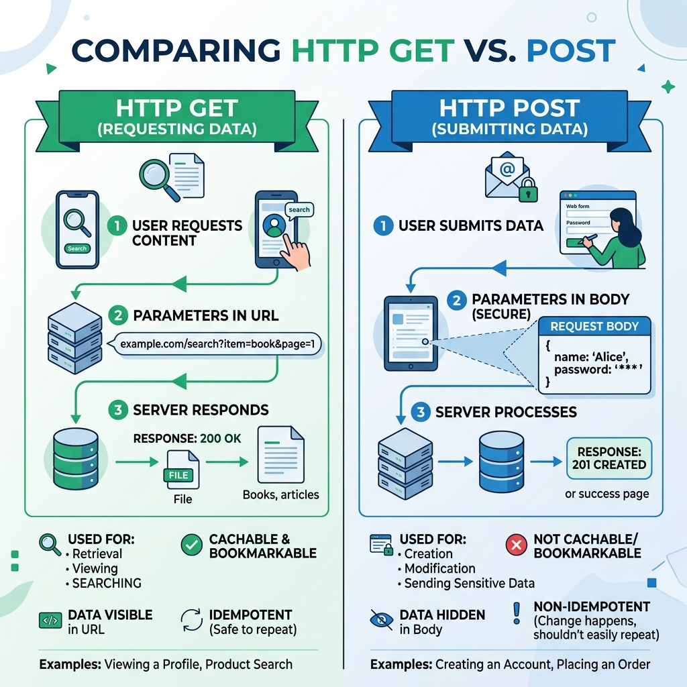

# Session 7: Django Forms Creation

So far, our users have only been able to *read* data from our web pages. To allow them to *send* data to the server (like signing up, sending a message, or uploading a file), we need HTML Forms. Django makes handling forms extremely secure and fast.

---

## 1. What are Django Forms?
A Django Form is a Python class that translates your form rules into HTML, validates the data the user submits, and securely converts that data into Python types.

*Why do we need them?* Writing HTML `<form>` tags manually is tedious. More importantly, validating user data manually (e.g., "Is this a real email? Is this password long enough?") is dangerous and prone to bugs. Django Forms handle this securely.

## 2. HTTP Methods: GET vs. POST


When a browser talks to a server, it uses "HTTP Methods". The two most important are GET and POST.

*   **GET:** Used to *request* data. When you type `google.com` and press enter, you are making a GET request. The parameters are visible in the URL (e.g., `?search=cats`). **Never use GET for sensitive data.**
*   **POST:** Used to *submit* data to change something on the server. When you submit a login form or upload an image, you are making a POST request. The data is hidden inside the body of the request, making it secure.

## 3. Creating a Simple Form (Standard Form)
To create a form, we usually make a file named `forms.py` inside our app folder.

```python
# forms.py
from django import forms

class ContactForm(forms.Form):
    name = forms.CharField(max_length=100)
    email = forms.EmailField()
    message = forms.CharField(widget=forms.Textarea)
```
*Why? This looks exactly like a Model! But instead of `models.Model`, we inherit from `forms.Form`. Django will automatically generate the HTML `<input>` tags for these fields.*

## 4. Instantiating, Processing, and Rendering a Form
To show the form on a webpage and process it when the user clicks "Submit", we use a View.

```python
# views.py
from django.shortcuts import render
from django.http import HttpResponse
from .forms import ContactForm

def contact_view(request):
    # Step 1: Did the user submit data?
    if request.method == 'POST':
        # Step 2: Instantiate the form with the submitted data
        form = ContactForm(request.POST)
        
        # Step 3: Validate the data
        if form.is_valid():
            # Step 4: Process the clean data
            user_name = form.cleaned_data['name']
            return HttpResponse(f"Thank you for your message, {user_name}!")
            
    else:
        # Step 5: If it's a GET request, instantiate an empty form
        form = ContactForm()
        
    # Step 6: Render the HTML template
    return render(request, 'contact.html', {'form': form})
```
*Why? We must handle both states. If the user just visited the page (GET), we give them an empty form. If they hit Submit (POST), we grab their data (`request.POST`), check if it's valid, and process it.*

To render it in the template (`contact.html`):
```html
<form method="POST">
    
    {{ form.as_p }}
    <button type="submit">Send</button>
</form>
```
*Why? `` is a crucial security feature that stops hackers from submitting forms on your behalf from another website. `{{ form.as_p }}` tells Django to render the form fields wrapped in HTML paragraph `<p>` tags.*

## 5. ModelForms: Connecting a Form directly to a Model
Most of the time, the data submitted in a form needs to be saved to the database. Instead of writing a Form that perfectly matches a Model, we can use a **ModelForm**.

```python
from django import forms
from .models import Book

class BookForm(forms.ModelForm):
    class Meta:
        model = Book
        fields = ['title', 'author', 'published_year']
```
*Why? By inheriting from `forms.ModelForm` and using the `Meta` class, Django looks at the `Book` model and automatically generates the exact form fields needed. If `published_year` is an `IntegerField` in the model, Django will ensure the user can only type numbers in the form!*

## 6. Form Field Validation
What if we want custom rules? Like "The author's name must start with 'A'"? We write custom clean methods.

```python
class BookForm(forms.ModelForm):
    # ... Meta class ...
    
    def clean_author(self):
        author_name = self.cleaned_data.get('author')
        if not author_name.startswith('A'):
            raise forms.ValidationError("The author's name must start with the letter A.")
        return author_name
```
*Why? Django automatically looks for methods named `clean_<fieldname>()`. If the rule is violated, it raises an error, and the form will be sent back to the user with an error message displayed next to the field.*

## 7. Widgets and Form Arguments
Widgets determine the *HTML output* of a field. For instance, a `CharField` defaults to `<input type="text">`, but you can change it to a password field or a text area.

```python
class LoginForm(forms.Form):
    username = forms.CharField(
        max_length=50, 
        label="Your Username",          # Form Argument
        help_text="Case sensitive!"     # Form Argument
    )
    password = forms.CharField(
        widget=forms.PasswordInput(attrs={'placeholder': 'Enter Password'}) # Widget
    )
```
*Why? Form Arguments (`label`, `help_text`, `required=False`) control the logic and text. Widgets (`PasswordInput`) control the specific HTML element and its attributes (like CSS classes or placeholders), ensuring the user's keystrokes are hidden.*


## Recommended Video Tutorials
Students can search for the following excellent YouTube tutorials on their own to supplement this session:

1. Corey Schafer - Django Tutorial Part 6: Forms
2. Tech With Tim - Django Tutorial - Forms
3. JustDjango - Django Forms Tutorial
4. Dennis Ivy - Django ModelForms

