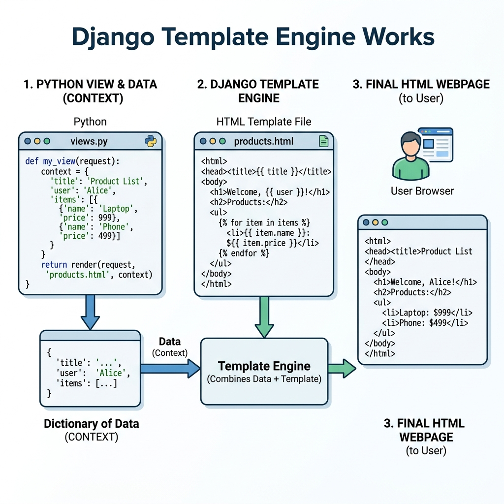

# Session 8: Django Templates

**Goal:** By the end of this session you will be able to use Django Template Language to inject data into HTML, write loops and conditions, apply filters, and render forms — all from a single HTML file.

We've been returning raw HTML strings or extremely simple HTML files from our views so far. Today, we focus heavily on the "T" in MVT. Django's Template Engine allows us to dynamically inject Python data into static HTML files, making our websites truly dynamic.

---

## 1. What are Django Templates?
A Django Template is basically an HTML file that has been supercharged with a special "Django Template Language" (DTL). DTL allows you to write loops, `if` statements, and inject variables directly into your HTML.



*Why? Standard HTML is completely static. If you have 100 students, writing 100 `<li>` tags in HTML is impossible. A template allows you to write one `<li>` tag inside a loop, and Django generates the 100 tags for you before sending the page to the user.*

---

## 2. Designing Template Folders
Django is very strict about where it looks for template files.
Inside your app folder, you must create a folder called `templates`. But if multiple apps have a file named `index.html`, Django might get confused.

**Best Practice Folder Structure:**
```text
my_app/
    templates/
        my_app/           <-- Notice we repeat the app name!
            index.html
            about.html
```
*Why? By nesting an extra folder with the app's name inside the `templates` folder, we create a "namespace". Now Django looks for `my_app/index.html` instead of just `index.html`, preventing conflicts with other apps.*

---

## 3. Creating HTML Files Inside Template Folders
Once the folder structure is set, you simply create standard `.html` files. You can write normal HTML, CSS, and JavaScript in these files.

---

## 4. Rendering Context in a Template
How does the data actually get from the database to the HTML file? Through a "Context Dictionary".

In your `views.py`:
```python
def student_profile(request):
    # This dictionary is the "Context"
    context = {
        'student_name': 'Alice Smith',
        'grade': 'A',
        'is_graduating': True
    }
    return render(request, 'my_app/profile.html', context)
```
*Why? The `render` function takes the `context` dictionary and securely hands it over to the template engine. Every key in the dictionary becomes a variable available in the template.*

---

## 5. Template Tags (``)
Tags provide logic in the rendering process. If it looks like Python code (loops, conditions, imports), it goes inside ``.

**For Loop:**
```html
<ul>

    <li>{{ student.name }}</li>

</ul>
```

*Why? `` and `` are a pair — Django renders everything between them once for each item in the list. You cannot write a Python `for` loop in raw HTML; this tag gives you that power.*

---

## 6. Conditions in Templates (``)
You can use `if`, `elif`, and `else` tags to dynamically show or hide parts of the webpage based on the context data.

```html

    <h1>Congratulations Graduate!</h1>

    <h1>Great job this year!</h1>

    <h1>Keep studying!</h1>

```
*Why? This allows you to serve a completely personalised webpage to different users using the exact same HTML file.*

---

## 7. Template Filters (`|`)
Filters transform the values of variables *before* they are displayed. You apply a filter using a pipe character `|`.

```html
<!-- If student_name is 'alice smith', this displays 'Alice smith' -->
<p>{{ student_name|capfirst }}</p>

<!-- Displays the number of items in a list -->
<p>Total Students: {{ student_list|length }}</p>

<!-- Formats a date object -->
<p>Joined on: {{ join_date|date:"F j, Y" }}</p>

<!-- Truncates long text to 50 characters -->
<p>{{ book_description|truncatewords:50 }}</p>
```

*Why? Filters let you control how data is displayed without changing the data itself or writing Python code in the view.*

---

## 8. Define Form in Template

Forms are passed from the view to the template through the context dictionary, just like any other variable. Django provides three built-in shortcuts to render a form's fields quickly:

```html
<form method="POST">
    

    <!-- Option 1: fields wrapped in <p> tags (most common) -->
    {{ form.as_p }}

    <!-- Option 2: fields wrapped in <tr> tags (looks good for longer forms) -->
    <table>
        {{ form.as_table }}
    </table>

    <!-- Option 3: fields wrapped in <li> tags -->
    <ul>
        {{ form.as_ul }}
    </ul>

    <button type="submit">Save</button>
</form>
```

**Which one to use?**
- `{{ form.as_p }}` — default choice for most forms. Fields stack vertically with clear spacing.
- `{{ form.as_table }}` — good when you have many fields and want a neater grid layout.
- `{{ form.as_ul }}` — least common; useful when you need to style individual fields with CSS list rules.

All three automatically include validation error messages next to fields when the form fails validation. You do not need to write any extra error-display code.

---

## Going Further (Bonus — Beyond the Exam)

The following two concepts are not in the official syllabus but will make your projects significantly better. Study them once the core sessions are comfortable.

### Template Inheritance — Write Your Navbar Once

Without template inheritance, you would copy-paste the same `<head>`, navigation bar, and footer into every HTML file. Template inheritance solves this.

**Step 1:** Create a `base.html` file that holds the shared layout:
```html
<!-- catalog/templates/catalog/base.html -->
<!DOCTYPE html>
<html>
<head>
    <title>My Library</title>
</head>
<body>
    <nav>
        <a href="/">Home</a> | <a href="/books/">Books</a>
    </nav>

    <main>
        
    </main>

    <footer>
        <p>© 2024 City Library</p>
    </footer>
</body>
</html>
```

**Step 2:** Every other template "extends" it and only fills in the blocks:
```html
<!-- catalog/templates/catalog/book_list.html -->


Book List


    <h1>All Books</h1>
    <ul>
        
            <li>{{ book.title }} by {{ book.author }}</li>
        
    </ul>

```

*Why? The navbar and footer only exist in one place (`base.html`). Change it once and it updates across all pages. Django replaces `` with whatever the child template puts inside its own `` tag.*

### The `` Tag — Never Hardcode URLs

Instead of writing raw paths like `<a href="/books/list/">`, use the `` tag with the URL's `name`:

```html
<!-- Fragile — breaks if you ever change the URL path -->
<a href="/books/list/">View Books</a>

<!-- Correct — uses the name from urls.py and never breaks -->
<a href="">View Books</a>
```

*Why? If you ever change `path('books/list/', ...)` to `path('catalog/books/', ...)`, every hardcoded `/books/list/` link breaks. The `` tag reads from `urls.py` and generates the correct path automatically.*

---

## Recommended Video Tutorials
Students can search for the following excellent YouTube tutorials on their own to supplement this session:

1. Corey Schafer - Django Tutorial Part 3: Templates
2. Tech With Tim - Django Tutorial - HTML Templates
3. Very Academy - Django Template Language
4. Dennis Ivy - Django Templates
