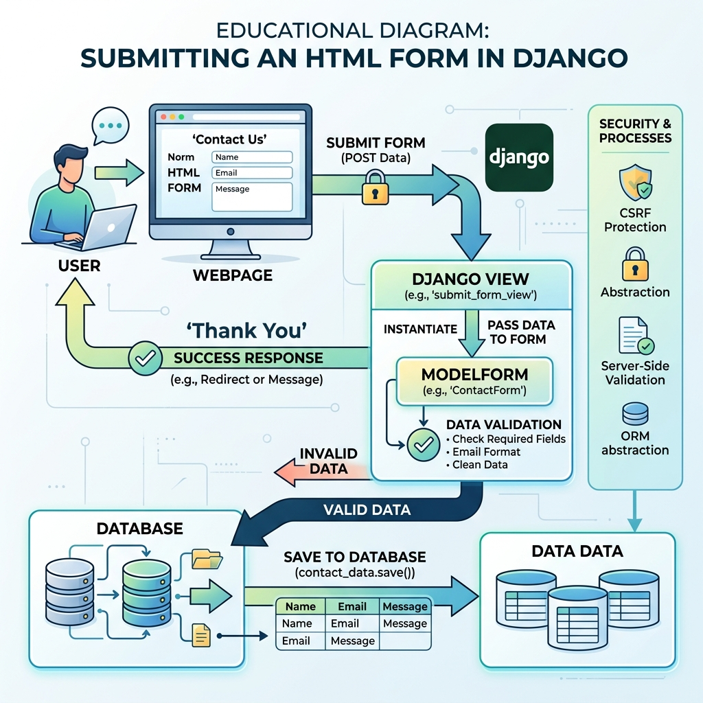

# Session 9: Practice & "Try It Yourself" Lab

Welcome to Week 3! Today is our final dedicated practice session before we dive into advanced topics like APIs. The goal today is to master the interaction between **Forms** and **Templates**. 

---

## Presenter's Guide

This lab session focuses on user interaction. Students will be building forms that actually write to the database.

### 1. The Core Concept to Review
Before letting students loose on the task, review this diagram on the projector:

Remind them of the "Two-Step" view process:
1.  **GET Request:** The view must instantiate an *empty* form and render it in the template.
2.  **POST Request:** The view must instantiate the form *with the user's data* (`request.POST`), validate it, save it, and usually redirect the user.

### 2. Structure of the Session
*   **First 15 Minutes:** Review the `request.method == 'POST'` logic loop.
*   **Next 90 Minutes:** Students complete the `class_task.md` challenge. 
*   **Last 15 Minutes:** Code review. Have a student explain how they used ``.

### 3. Common Pitfalls to Watch Out For
*   **Missing CSRF Token:** If a student complains they are getting a "403 Forbidden" error when they click submit, they forgot the `` in their HTML.
*   **Forgetting to pass the form to the context:** If the template is blank, they likely forgot the `{'form': form}` dictionary in their `render()` function.
*   **The "Save loop":** If data isn't saving, check if they forgot the `form.save()` line, or if they accidentally put it outside the `form.is_valid()` check.

## Recommended Video Tutorials
Supplement this session with these excellent YouTube tutorials:

1. **Corey Schafer** - [Django Tutorial Part 6: Form Practice](https://www.youtube.com/watch?v=qLRx9b1OOxo)
2. **Programming with Mosh** - [Django Models and Forms](https://www.youtube.com/watch?v=rHux0gMZ3Eg)
3. **FreeCodeCamp** - [Django Forms & Templates Practice](https://www.youtube.com/watch?v=F5mRW0jo-U4)
4. **Dennis Ivy** - [Django Forms Review](https://www.youtube.com/watch?v=llbtoQTt4qw)

