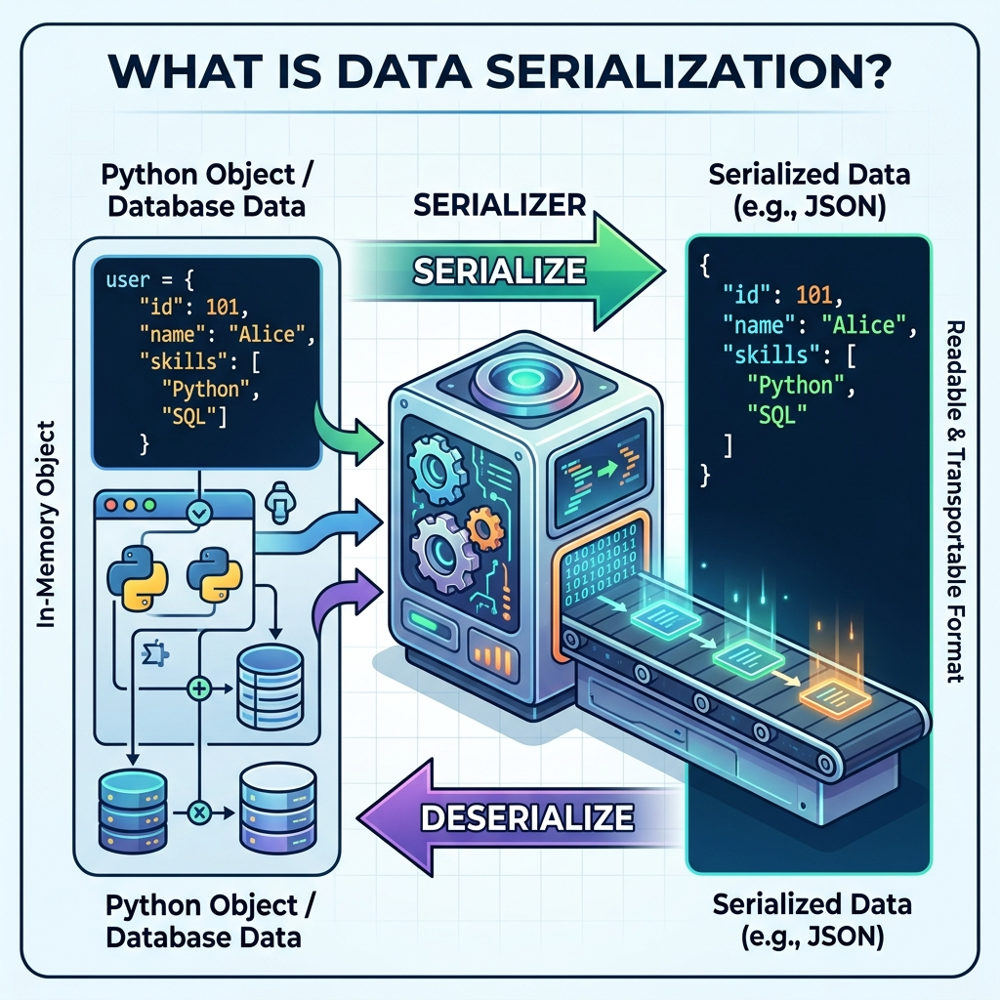

# Session 10: Django Serializers

**Goal:** By the end of this session you will have installed Django REST Framework, created a ModelSerializer, wired it to a ViewSet and Router, and be able to see live JSON data in your browser.

Up until now, our web applications have returned HTML pages intended for humans to read. But what if we want to build a mobile app? Or let another website talk to our database? Machines don't want to read HTML; they want pure data. This is where **Serializers** and **APIs (Application Programming Interfaces)** come in.

---

## 1. What are Serializers and Deserializers?

To allow machines to talk to our Django app, we need a universal language. The most popular language for this is JSON (JavaScript Object Notation).

*   **Serialization:** The process of translating a complex Django database Model (which is a Python object) into a simple JSON text string that can be sent over the internet.
*   **Deserialization:** The reverse process. Taking a JSON text string sent from a user's mobile app, validating it, and converting it back into a Django Python object to save in the database.



**What JSON actually looks like** — this is what your API will return to a browser or mobile app:

```json
[
    {
        "id": 1,
        "title": "The Hobbit",
        "author": "J.R.R. Tolkien",
        "published_year": 1937
    },
    {
        "id": 2,
        "title": "1984",
        "author": "George Orwell",
        "published_year": 1949
    }
]
```

*Why JSON? It is a plain text format that every programming language can read. A React website, an iOS app, and an Android app written in completely different languages can all consume the same Django API because they all understand JSON.*

---

## 2. Installing the Django REST Framework (DRF)
Django does not come with robust serialization built-in. We use an incredibly popular third-party package called the **Django REST Framework (DRF)**.

**Step 1: Install it via terminal**
```bash
pip install djangorestframework
```

**Step 2: Add it to your project settings**
Open `settings.py` and add `rest_framework` to your `INSTALLED_APPS`:
```python
INSTALLED_APPS = [
    # ... other apps ...
    'rest_framework',   # ← don't forget the comma
]
```

---

## 3. Creating and Importing a Serializer
Just like we create `forms.py` for HTML forms, we create `serializers.py` in our app folder for serializers.

```python
# catalog/serializers.py
from rest_framework import serializers
from .models import Book

class BookSerializer(serializers.ModelSerializer):
    class Meta:
        model = Book
        fields = ['id', 'title', 'author', 'published_year']
        # Alternative: include every field from the model automatically
        # fields = '__all__'
```
*Why? Notice how similar this is to a `ModelForm`! It acts exactly like a form, but instead of generating HTML input boxes, it generates JSON data. The `fields` list controls exactly which columns appear in the API response.*

---

## 4. Different Types of Serializers
DRF provides two main types of serializers:
1.  **`serializers.Serializer`:** Similar to a standard Django `Form`. You must manually define every field and manually write the `create()` and `update()` logic. Use this for complex data that doesn't map directly to a database model.
2.  **`serializers.ModelSerializer`:** Similar to a Django `ModelForm`. It automatically generates fields based on the Model and automatically implements `create()` and `update()`. This is used 95% of the time.

---

## 5. Defining Fields and Arguments

You can control exactly how each field behaves:

```python
class BookSerializer(serializers.ModelSerializer):
    # Making a field read-only — the API will show it but not allow changes to it
    author = serializers.CharField(read_only=True)

    class Meta:
        model = Book
        fields = ['id', 'title', 'author', 'published_year']
```

*Why `read_only`? Some fields — like an auto-generated ID or a creation timestamp — should never be changed by an API user. `read_only=True` ensures they appear in the response but are ignored in any POST or PUT request.*

---

## 6. ViewSets and URLs with Serializers

To actually serve this JSON data to the internet, we need a View and a URL. DRF introduces **ViewSets** which are super-powered Class-Based Views that handle Create, Read, Update, and Delete automatically.

**In `views.py`:**
```python
from rest_framework import viewsets
from .models import Book
from .serializers import BookSerializer

class BookViewSet(viewsets.ModelViewSet):
    queryset = Book.objects.all()
    serializer_class = BookSerializer
```
*Why? Instead of writing 5 different view functions (one for listing, one for viewing a single item, one for creating, one for updating, one for deleting), `ModelViewSet` gives us all 5 automatically. It takes our database query (`queryset`) and pushes each record through `BookSerializer` to convert it to JSON.*

**In `urls.py`:**
Because a ViewSet handles multiple URLs automatically, standard `path()` functions would be tedious. DRF provides a `DefaultRouter` that generates all the URLs for us:

```python
from django.urls import path, include
from rest_framework.routers import DefaultRouter
from .views import BookViewSet

router = DefaultRouter()
router.register(r'books', BookViewSet)

urlpatterns = [
    path('api/', include(router.urls)),
]
```
*Why? One line — `router.register(r'books', BookViewSet)` — automatically creates all the URLs listed below.*

The router generates these URLs automatically:

| URL | HTTP Method | What it does |
| :--- | :--- | :--- |
| `/api/books/` | GET | List all books |
| `/api/books/` | POST | Create a new book |
| `/api/books/1/` | GET | Get the book with id=1 |
| `/api/books/1/` | PUT | Replace the book with id=1 |
| `/api/books/1/` | PATCH | Partially update the book with id=1 |
| `/api/books/1/` | DELETE | Delete the book with id=1 |

---

## 7. Testing Your API

Once the server is running, you can test everything directly in your browser — no extra tools needed.

1. Run `python manage.py runserver`
2. Visit `http://127.0.0.1:8000/api/books/` in your browser
3. You will see the **DRF Browsable API** — a built-in web interface that shows your JSON data with a navigation panel
4. **To create a new book:** Scroll to the bottom of the page. You will see an HTML form. Fill it in and click the **POST** button.
5. **To view a single book:** Click on the URL shown next to one of your records, or visit `/api/books/1/` directly.
6. **To test from the book detail page:** You will see **PUT** and **DELETE** buttons.

> The Browsable API is a DRF feature built specifically for development and testing. It makes your first API very easy to verify without needing any external tools.

---

## Recommended Video Tutorials
Students can search for the following excellent YouTube tutorials on their own to supplement this session:

1. Dennis Ivy - Django REST Framework API
2. JustDjango - Django REST Framework Basics
3. CodingEntrepreneurs - Django REST API Series
4. Tech With Tim - Django API Tutorial
