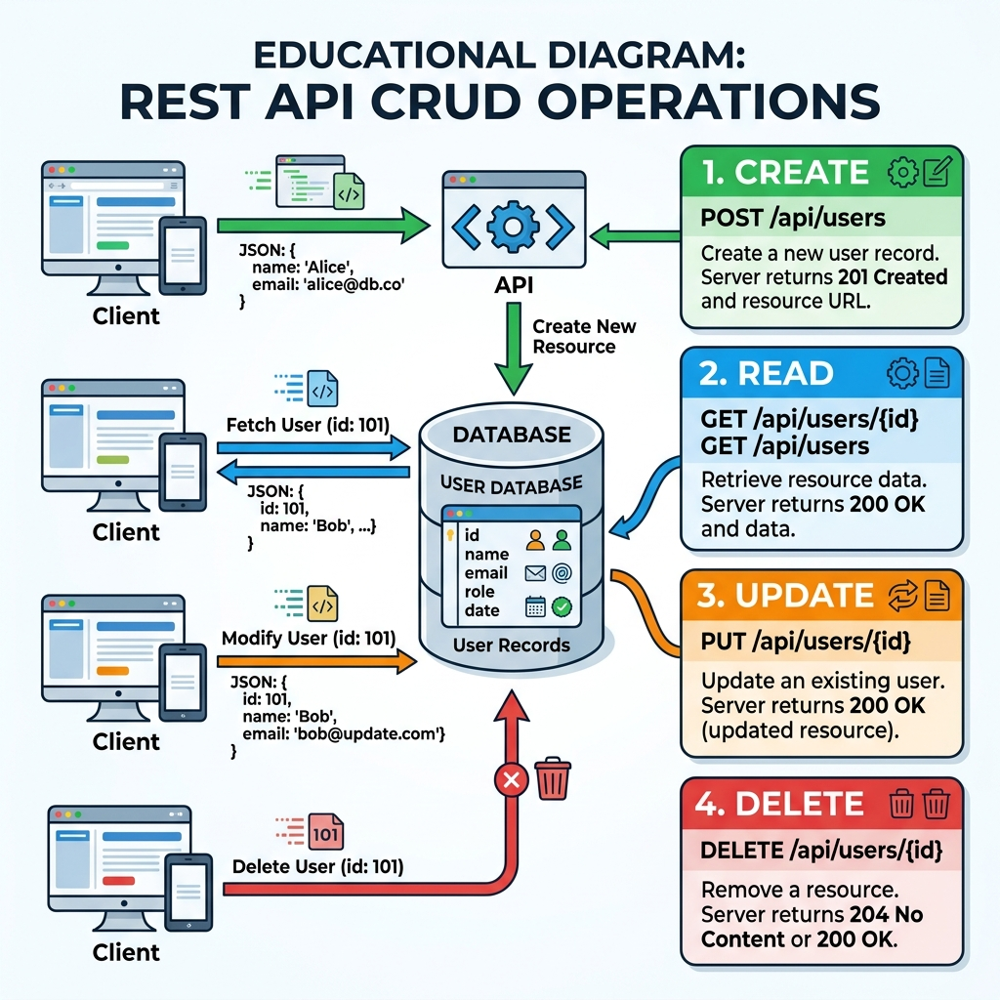

# Session 11: Django's REST Framework (In-Depth)

In our previous session, we built our first Serializer and ViewSet. Today, we look deeper at the entire Django REST Framework (DRF) architecture, specifically focusing on how APIs handle Data Operations (CRUD).

---

## 1. Installation and Configuration Refresher
To build APIs in Django, we must use DRF.
*   **Install:** `pip install djangorestframework`
*   **Configure:** Add `'rest_framework'` to the `INSTALLED_APPS` list inside `settings.py`.

*Why? Django core knows how to render HTML, but it doesn't know how to easily generate or parse JSON data. DRF is an add-on that provides this functionality.*

## 2. Serialization: The Bridge
Serialization is the core of any API. 
*   **Serialization:** Database Model `->` Python Dictionary `->` JSON String.
*   **Deserialization:** JSON String `->` Python Dictionary `->` Validated Database Model.

If you don't serialize your data, a mobile app (which might be written in Swift or Kotlin) won't know how to read your Python objects.

## 3. Defining a ViewSet
A `ViewSet` is a class that combines the logic for multiple related views into a single class. 

```python
from rest_framework import viewsets
from .models import Employee
from .serializers import EmployeeSerializer

class EmployeeViewSet(viewsets.ModelViewSet):
    queryset = Employee.objects.all()
    serializer_class = EmployeeSerializer
```
*Why? Instead of writing 5 different functions (one for listing, one for viewing a single item, one for creating, one for updating, one for deleting), `ModelViewSet` gives us all 5 automatically.*

## 4. Explaining API URLs (Routers)
Because a ViewSet handles multiple routes automatically, standard Django `path()` functions are tedious to write. DRF provides a `DefaultRouter`.

```python
from rest_framework.routers import DefaultRouter
from .views import EmployeeViewSet

router = DefaultRouter()
router.register(r'employees', EmployeeViewSet)
# This automatically generates:
# /employees/ (GET list, POST create)
# /employees/<id>/ (GET retrieve, PUT update, DELETE delete)
```

## 5. Define and Explain CRUD Operations
CRUD is the fundamental concept behind all data storage. In REST APIs, we map CRUD operations to HTTP Methods.



1.  **C - Create:** (HTTP `POST`) Adding a new record to the database. Example: Signing up for a new account.
2.  **R - Read:** (HTTP `GET`) Retrieving records from the database. Example: Viewing your profile page.
3.  **U - Update:** (HTTP `PUT` or `PATCH`) Modifying an existing record. Example: Changing your password.
4.  **D - Delete:** (HTTP `DELETE`) Removing a record. Example: Deleting a post.

*Why do we map them? By standardizing these verbs, developers all over the world know exactly how to interact with your API without having to read extensive documentation.*

## 6. Run Server and Check API
Start your server (`python manage.py runserver`). When you navigate to an API URL in your browser, DRF provides the **Browsable API**. 
This is a built-in web interface that allows you to click through your API, view JSON responses, and even submit POST requests using a built-in form, making testing incredibly easy for developers!
