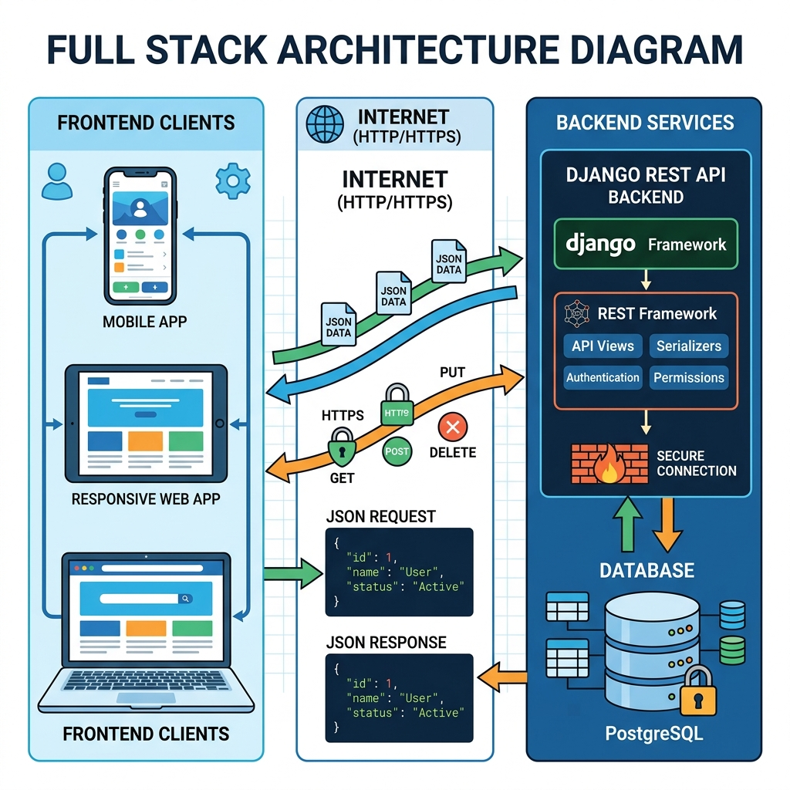

# Session 12: Practice & "Try It Yourself" Lab for APIs

Welcome to the final dedicated session of the core module! Today is all about cementing the concepts of Serializers and the Django REST Framework (DRF) before students tackle their final projects.

---

## Presenter's Guide

This lab session focuses on independent practice. Students will be building a complete API from scratch without step-by-step guidance.

### 1. The Core Concept to Review
Before the lab begins, bring up this architecture diagram on the projector:

Explain to the students *why* we spent the last two sessions learning APIs:
*   **Decoupling:** A Django API backend can serve data to a React website, an iOS app, and an Android app all at the same time.
*   **JSON is Universal:** The JSON data format is understood by virtually every programming language on earth.

### 2. Structure of the Session
*   **First 15 Minutes:** Q&A on DRF. Review how `ModelSerializer` and `ModelViewSet` automate the heavy lifting.
*   **Next 90 Minutes:** Students complete the `class_task.md` challenge independently. 
*   **Last 15 Minutes:** Code review. Have a student demonstrate creating a record via the Browsable API.

### 3. Common Pitfalls to Watch Out For
*   **Forgetting to Register the Router:** If a student says "Page Not Found", check their `urls.py`. Did they register the ViewSet to the router? Did they include `router.urls` in `urlpatterns`?
*   **`fields = '__all__'` typo:** Ensure they use two underscores on each side.
*   **Missing comma in `INSTALLED_APPS`:** A classic error when adding `'rest_framework'`.

## Recommended Video Tutorials
Supplement this session with these excellent YouTube tutorials:

1. 
2. 
3. 
4. 

